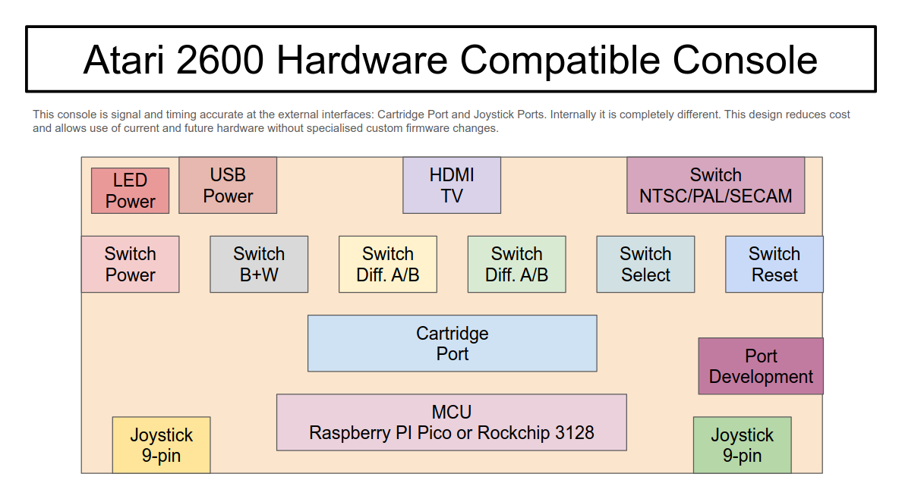

# Atari 2600 Hardware Compatible Console

## IMPORTANT

This project is still in proof of concept stage.

Risks:-
 * External I/O necessary for Joystick/Paddles and Console Switches, and the required performance.
 * CPU power.
 * Accurate timers.
 * I/O not meeting minimums required for Atari 2600 compatibility.

These can be mitigated by a different CPU but it will still require HDMI video output.

## Introduction

This project showcases a hardware compatible implementation of an Atari 2600 Video Computer System console.
This differs from other implementation that are either an emulation or FPGA.
It utilises latest off the shelf components and microcontroller with software emulation of the hardware removing the need for an FPGA.
This seemed the easiest and cheapest method of implementing an Atari 2600 console that can run original cartridges.
Also as it is signal and timing accurate at the external ports (cartridge and joystick), it will work with all hardware cartridges in existence without tailored software customisation for each bank-switching scheme.

## Why

1. Need for a test bed for some new Atari 2600 cartridges that are in development.
   * New method for improved audio and hi-res graphics on the Atari 2600.
   * Supports emulation of other platforms for faster porting of their game libraries.
   * Simpler development environment.
   * Build to target real hardware or Linux/Windows/Mac executables.
2. Cheap way to get an Atari 2600 compatible console.
3. Play original and new homebrew cartridges.
4. No need to keep updating the software for new cartridge bank-switching / co-processor implementations.
5. Compatibility kept with current and new hardware.

## Architecture

### Block Diagram

### Features

* Power
  * 5V USB C
  * On / Off Switch
  * LED Indicator
* Video
  * HDMI Output Video and Audio
* Switches
  * Colour / Black and White
  * Difficulty Player 1 A / B
  * Difficulty Player 2 A / B
  * Select
  * Reset
  * Console Mode
    * NTSC
    * PAL
    * SECAM
* Joystick
  * DE-9 Port Player 1
    * 4 Digital I/O
    * 1 Digital In
    * 2 Analogue In
  * DE-9 Port Player 2
    * 4 Digital I/O
    * 1 Digital In
    * 2 Analogue In
* Cartridge Port
  * 2 Power
  * 1 Shield Ground
  * 12 Address Bus
  * 1 Chip Select
  * 8 Data Bus
* Development
  * Port
* MCU
  * Raspberry PI Pico (option for Rockchip 3128)

## Licence

Copyright (c) 2025 Justin Lane.\
All rights reserved.\
atari2600@jigglesoft.co.uk

**Note:** *FINAL LICENSING IS TO BE DECIDED.* Likely to be just free for non-commercial use.

SOFTWARE DEVELOPMENT IS CURRENTLY UNDERWAY IN ANOTHER REPOSITORY UNTIL THE LICENSING HAS BEEN DECIDED.
